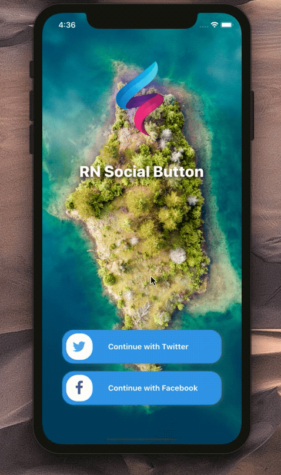
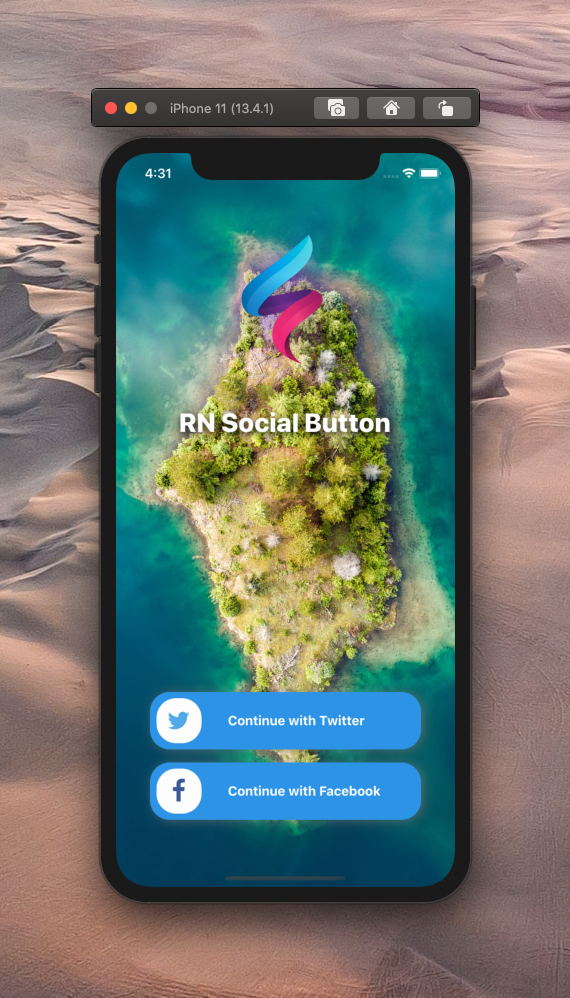

[](https://github.com/WrathChaos/react-native-social-button)

[](https://github.com/WrathChaos/react-native-social-button)

[](https://www.npmjs.com/package/react-native-social-button)
[](https://www.npmjs.com/package/react-native-social-button)

[](https://opensource.org/licenses/MIT)
[](https://github.com/prettier/prettier)

<p align="center">
  
  
</p>

# Installation

Add the dependency:

```ruby
npm i react-native-social-button
```

## Peer Dependencies

###### IMPORTANT! You need install them

Do not forget to go `ios` folder and `pod install`

```js
"react": ">= 16.x.x",
"react-native": ">= 0.55.x",
"react-native-androw": "0.0.34",
"react-native-vector-icons": "^6.6.0",
"react-native-dynamic-vector-icons": "^0.1.1",
"@freakycoder/react-native-helpers": "^0.1.3"
```

# Usage

## Import

```js
import SocialButton from "react-native-social-button";
```

## Basic Usage

```js
<SocialButton />
```

## Advanced Usage

```js
<SocialLoginButton
  name="twitter"
  color="#52a9e8"
  text="Continue with Twitter"
  iconComponent={
    <FastImage
      style={{ height: 50, width: 50 }}
      source={require("../assets/your-image.png")}
    />
  }
/>
```

# Configuration - Props

| Property            |     Type      |        Default         | Description                                                                    |
| ------------------- | :-----------: | :--------------------: | ------------------------------------------------------------------------------ |
| text                |    string     | Continue with Facebook | change the button's inside text                                                |
| onPress             |   function    |        default         | use this to set your own function for onPress                                  |
| width               | string/number |   ScreenWidth \* 0.8   | change the main button's width                                                 |
| height              | string/number |           70           | change the main button's height                                                |
| borderRadius        |    number     |           24           | change the main button's border radius                                         |
| backgroundColor     |     color     |        #2d93e7         | change the main button's background color                                      |
| iconWidth           | string/number |           55           | change the icon's width                                                        |
| iconHeight          | string/number |           55           | change the icon's height                                                       |
| iconBorderRadius    |    number     |           24           | change the icon's container's border radius                                    |
| iconBackgroundColor |     color     |        #fdfdfd         | change the icon's container's background color                                 |
| iconComponent       |   component   |          Icon          | use this to set your own icon component instead of default one                 |
| shadowStyles        |     style     |        default         | use this to set your own style for main button's shadow instead of default one |
| textStyle           |     style     |        default         | use this to set your own style for main button's text instead of default one   |

## Future Plans

- [x] ~~LICENSE~~
- [ ] Write an article about the lib on Medium

# Credits

- Background Photo by [Dave](https://unsplash.com/@johnwestrock?utm_source=unsplash&utm_medium=referral&utm_content=creditCopyText) on [Unsplash](https://unsplash.com/)

- [Logo vector created by freepik - www.freepik.com](https://www.freepik.com/free-photos-vectors/logo)

## Author

FreakyCoder, kurayogun@gmail.com

## License

React Native Social Button is available under the MIT license. See the LICENSE file for more info.
